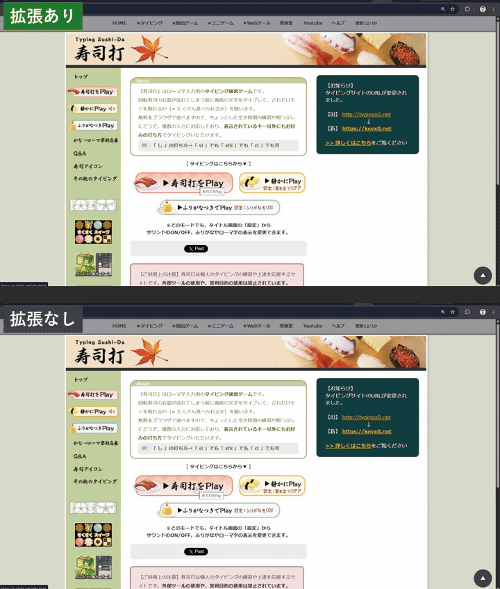

# sushidash

English | [日本語](README.md)

A Chrome extension that speeds up loading of Sushida (寿司打, a Unity WebGL typing game).

[](https://github.com/kyo5uke/sushidash/actions/workflows/ci.yml)
[](LICENSE)



```text
[sushidash] patcher initialized (XHR override active)
[sushidash] intercepting XHR: https://sushida.net/files/v1_3/Web.data.unityweb
[sushidash] splash byte patched at block 0 offset 4200
[sushidash] web.data patched in 12.4ms: 7411331 → 7490398 B
[sushidash] cache stored: Web.data.unityweb (7,490,398 B)
[sushidash] canvas first draw via drawArrays
```

Staring at Unity's Neutral splash logo for ~2 seconds every time you open Sushida gets old.
sushidash bundles no game files — it patches `Web.data.unityweb` in the browser to turn the
splash off, and caches the three `.unityweb` files in Cache Storage so the second load hits zero
network.

> A personal, educational, unofficial extension. Not affiliated with sushida.net.
> How the patch works (UnityWebData / UnityFS / LZ4 / splash byte) is in [HOW_IT_WORKS.md](HOW_IT_WORKS.md) (Japanese).

## What it does

- Turns the Unity splash (Neutral logo) OFF — ~2s faster startup
- Stores the three `.unityweb` files in Cache Storage — zero network on subsequent loads
- Prefetches the three files at `document_start` — parallelizes even the first load
- Fades the canvas in over 500ms
- Defers AdSense until first canvas draw + 1.5s (ads still load, just later)

## Install

Download the latest `sushidash-*.zip` from [Releases](https://github.com/kyo5uke/sushidash/releases), unzip it, then:

1. Open `chrome://extensions/`
2. Enable "Developer mode" (top right)
3. "Load unpacked" → select the unzipped folder

> Chrome only accepts an unpacked folder (not a zip or a URL). The startup "developer mode extensions" warning and the lack of auto-update are inherent to this method.

From source (for developers):

```sh
git clone https://github.com/kyo5uke/sushidash
```

then select the `src/` folder in step 3.

No game files (`.unityweb`) are bundled. The patch is applied in the browser to live data fetched from sushida.net on every load.

## Usage

Just open [sushida.net/play.html](https://sushida.net/play.html). Success means the game fades in
directly without the Neutral logo. Look for `[sushidash]` lines in the DevTools Console.

| Log | Meaning |
| --- | --- |
| `splash byte patched at block 0 offset N` | splash patch applied |
| `web.data patched in Xms: A → B` | patch time and before/after size |
| `cache stored: ...` | saved to Cache Storage |
| `cache hit (XHR/fetch): ...` | served from cache (subsequent loads) |
| `prefetched: ...` | prefetch done |
| `canvas first draw via ...` | game started drawing |

Behavior is tunable via the `CONFIG` block at the top of `enhance.js` (fade duration, ad delay, etc.).

## Notes

- Unofficial. Check sushida.net's terms of service yourself.
- If the site bumps the file version (`v1_3`), the splash patch becomes a no-op and the original behavior returns (fail-safe). Prefetch will 404 and warn in the Console — update `PREFETCH_VERSION` in `patcher.js`.
- No LZ4 encoder is implemented, so the first block is written back uncompressed. The data Unity reads grows by ~80KB (transfer from sushida.net is unchanged).
- Ads appear ~1.5s later than usual.

## License

[MIT](LICENSE)
